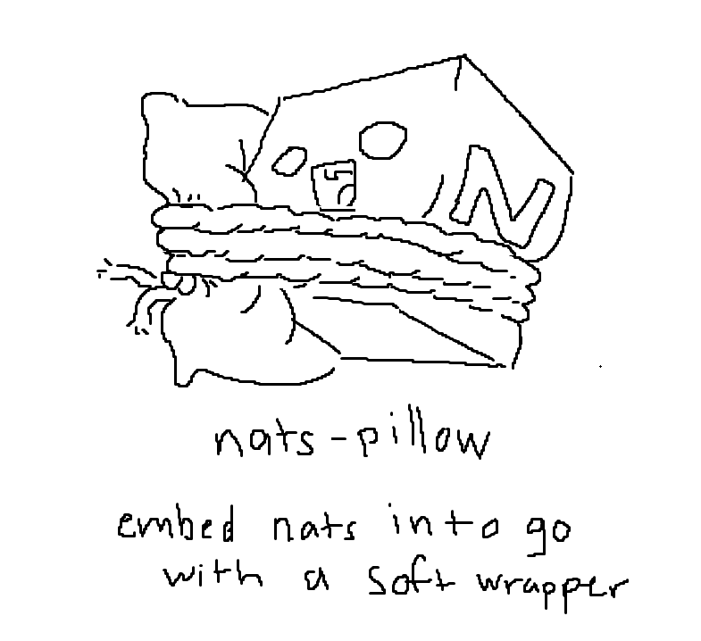

# NATS Pillow
A soft little wrapper for NATS, to remove the boilerplate for certain use cases.

## Features
- Flyio Adapter (auto clustering w/ route updates, node naming based on fly machine ID)
- Boilerplate for using NATS embedded in go

*Credit to [@whaaaley](https://github.com/whaaaley) for project name and icon*
